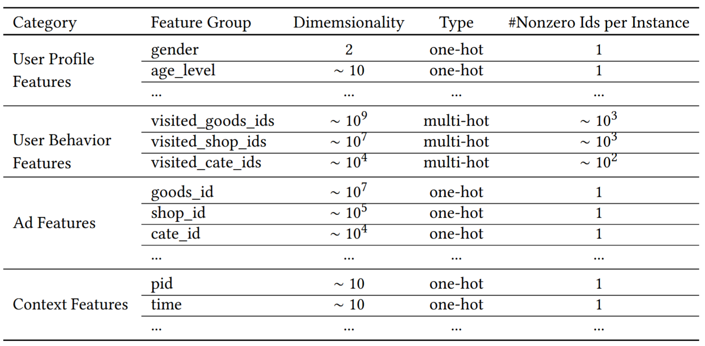
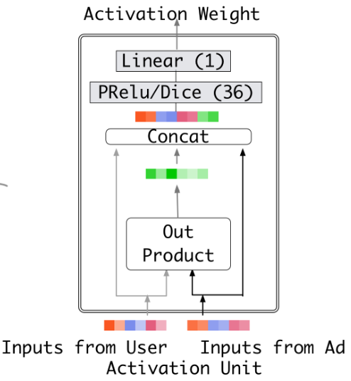
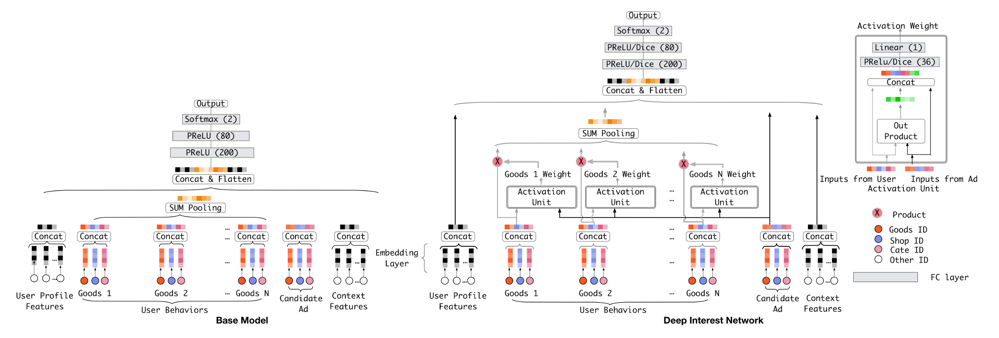
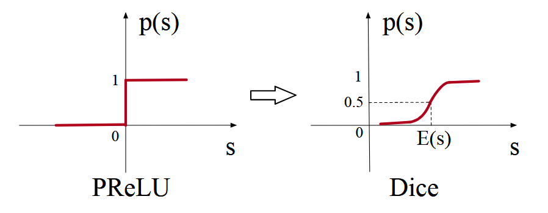

# DIN (Deep Interest Network)

**DIN的基本思想**：考虑到**用户的兴趣是多样化的**，通过设计一个局部激活单元，从用户的交互历史中自适应地学习出针对给定候选广告的用户兴趣表示，而不是对所有候选广告都使用同样的用户兴趣表示。这样，对于不同的候选广告，用户的兴趣表示都有所不同，大大提升了模型的表示能力。

此外，为训练参数规模很大的深度网络，还引入了两个新技术：

- `mini-batch aware regularization`
- `data adaptive activation function`

## 0. 背景

在DIN提出前，CTR预测任务中基于深度学习的方法基本都基于Embedding & MLP范式：将高基数的稀疏特征（类别特征）先映射为低维的嵌入向量，然后通过某些池化（如平均/加和）的方式转化为定长向量（因为交互历史通常是变长的），再与其它特征拼接，输入MLP中，学习特征之间的非线性关系。

这个方法有以下缺陷：

1. 用户的多样化兴趣（通过历史交互序列信息体现）被压缩为一个定长向量，**表示能力大大受限**，除非增大向量的长度，但这又会导致模型参数的增加，加大过拟合风险以及计算和存储的负担
2. 在预测某个候选广告的CTR时，没必要把所有的多样化兴趣都用上，因为通常只有其中部分兴趣信息与当前候选广告相关

DIN通过引入注意力机制，根据候选广告对历史交互行为赋予不同的权重，得到一个与候选广告相关的用户兴趣表示。

训练有大规模稀疏特征的工业级深度神经网络存在很大的挑战：比如，使用SGD进行训练时，在输入特征很稀疏的情况下，输入的值中有很多0，这会导致反向更新参数时，实际上只有很少的一部分参数需要更新（比如，某个类别特征的基数为1000，但是现在batch中的样本仅涉及其中少数几个类别，则只有这几个类别的Embedding向量参数需要更新），但是如果使用的是带 $L_2$ 正则化的SGD，还需要计算 $L_2$ 正则化项的值（会使用所有参数），这在参数规模很大时是不可接受的。为了能高效地进行正则化（为什么一定要正则化，见[Mini-batch Aware Regularization](#Mini-batch Aware Regularization)），设计了`mini-batch aware regularization`方法，仅计算每个batch中非零特征参数的L2范数。作者还设计了一个根据batch数据自适应（通过调整拐点）的激活函数，在训练有稀疏特征的工业级网络中表现很好。

## 1. 网络结构

### 特征表示

CTR预测任务的输入数据的特征通常都是类别特征（由于每个类别特征可能有多种取值，每个类别特征也可以视为一个特征组），一般都会先转化为高维的稀疏编码。比如对第 $i$ 个类别特征，编码后的结果为 $\boldsymbol{t}_i \in R^{K_i}$，$K_i$ 表示维度。$\boldsymbol{t}_i$ 中的元素值只有0/1。当元素值的和为1时，对应one-hot编码方式；当元素值的和大于1时，对应multi-hot编码方式。一个样本可以表示为所有的 $M$ 个特征组的特征编码拼接后的结果：
$$
\boldsymbol{x} = [\boldsymbol{t}_1^T, \boldsymbol{t}_2^T, \dots \boldsymbol{t}_M^T]^T
$$

>#### 说明示例
>
>数据有4个特征组，分别为`weekday`, `gender`, `visited_cate_ids`, `ad_cate_id`。
>
>某样本的特征取值情况如下：
>$$
>{\rm weekday=Friday, gender=Female, visited\_cate\_ids=\{Bag, Book\}, ad\_cate\_id=Book}
>$$
>则编码后的结果是：
>$$
>\underbrace{[0, 0, 0, 0, 1, 0, 0]}_{\text{weekday=Friday}} \quad \underbrace{[0, 1]}_{\text{gender=Female}} \quad \underbrace{[0, \dots, 1, \dots, 1, \dots, 0]}_{\text{visited\_cat\_ids = \{Bag, Book\}}} \quad \underbrace{[0, \dots, 1, \dots, 0]}_{\text{ad\_cate\_id = Book}}
>$$

DIN系统考虑的特征主要有4个类别，每个类别中又有很多的特征组，由于用户有一定长度的交互历史，`User Behavior Features`中的特征都是multi-hot的（这些特征包含关于用户兴趣的丰富信息），如下图所示：



注意：这里没有列举任何的组合特征（交互特征），因为DIN会使用深度神经网络来捕捉特征之间的交互关系。

### Base Model (基于Embedding & MLP)

由3个部分组成：

- 嵌入层：对one-hot编码的特征，会得到一个嵌入向量，对multi-hot编码的特征，会得到一组嵌入向量。

- 池化和拼接层：由于不同的用户的交互历史长度不同，不同的用户由`User Behavior Features`中的各特征嵌入后得到向量组的大小不同，但全连接神经网络只能处理定长输入，一个常见的做法是对向量组中的所有向量进行池化（最常用的两种池化方式就是平均池化和加和池化），得到一个向量。

  嵌入和池化都是在每个特征组上进行的，完成后会对每个特征组得到的向量进行拼接，得到完整的输入表示。

- MLP层：用于学习特征之间的交互关系。

损失函数：BCE。

### DIN

在Base Model中，无论候选物品是什么，用户的User Behavior Features相关的特征表示都是一样的。为了更充分、有效地利用这些关键信息，基于注意力机制构造了局部激活单元，使用注意力池化替代简单的池化，其它的网络结构与Base Model是一致的。

注意力池化的数学表示：
$$
\boldsymbol{v}_U(A) = f(\boldsymbol{v}_A, \boldsymbol{e}_1, \boldsymbol{e}_2, \dots, \boldsymbol{e}_H) = \sum_{j=1}^{H} a(\boldsymbol{e}_j, \boldsymbol{v}_A)\boldsymbol{e}_j = \sum_{j=1}^{H} \boldsymbol{w}_j\boldsymbol{e}_j
$$
其中 $\boldsymbol{v}_A$ 是候选物品A的嵌入向量，$\{\boldsymbol{e}_1, \boldsymbol{e}_2, \dots, \boldsymbol{e}_H\}$ 是用户历史交互物品的嵌入向量集合。

> #### 关于注意力权重的具体计算方式
>
> 论文和官方的Repo给出的实现是不一致的！另外，这里的 $\boldsymbol{w}_j$ 是**没有经过softmax归一化处理**的，因为作者指出不进行归一化处理可以在某种程度上保留**兴趣强度**的信息。
>
> ##### 论文实现
>
> 作者没有直接给出数学表达式，而是用架构图和简单的文字进行了说明，由于图中展示的`Out Product`的输出是一个向量而非矩阵，这里应该是说错了，把元素积说成了外积（在https://github.com/zhougr1993/DeepInterestNetwork/issues/8中作者进行了说明）。
>
> 把候选物品表示、每个历史交互物品的表示以及二者的元素积拼接在一起后经过激活函数再通过线性变换投影为一个值，作为权重。
>
> 
>
> ##### 官方repo实现（见[GitHub - zhougr1993/DeepInterestNetwork](https://github.com/zhougr1993/DeepInterestNetwork)）
>
> 官方代码中实际上是将 `query`、`key`、`query - key`以及 `query * key`拼接在一起，而不是将`query`、`key`、`query * key`拼接在一起：
>
> ```python
> din_all = tf.concat([queries, keys, queries-keys, queries*keys], axis=-1)
> ```

下面是Base Model和DIN的结构对比（每个物品的嵌入向量由这个物品的`Goods ID`, `Shop ID`, `Cate ID`的嵌入向量拼接得到）：



## 2. 模型训练技巧

### Mini-batch Aware Regularization

过拟合是训练工业级神经网络常见的问题，因为工业级网络的参数规模通常较大。但是在稀疏输入+上亿参数的网络中，使用L1或L2正则化时不现实的，因为使用基于SGD的优化方法时，如果不使用正则化，实际上只有当前batch中非0的稀疏特征对应的嵌入向量中的参数需要更新，一旦用了正则化，对每个batch都要计算全量参数的L1/L2范数，计算和存储的代价很高。

考虑到CTR网络中的参数主要来源于嵌入向量（嵌入层），计算L2正则化项时仅使用当前batch中涉及到的非零稀疏特征对应的嵌入向量参数。用 $\mathbf{W}\in \mathbb{R}^{D\times K}$ 表示整个embedding dictionary，其中 $D$ 为每个嵌入向量的维度，$K$ 为所有特征类别的基数总和；用 $\boldsymbol{w}_j\in \mathbb{R}^D$ 表示第 $j$ 个嵌入向量，$\boldsymbol{x}_j$ 表示第 $j$ 个稀疏特征的取值。

如果在全样本上计算L2正则项，计算方式为：
$$
L_2(W) = \sum_{(x,y) \in S} \sum_{j=1}^K \frac{I(x_j \neq 0)}{n_j} ||w_j||_2^2
$$
这里 $n_j$ 是特征 $j$ 非零的情况在所有的样本中出现的总次数。

如果以batch为单位进行计算，可以展开为：
$$
L_{2}(W) = \sum_{j=1}^{K} \sum_{m=1}^{B} \sum_{(x,y) \in \mathcal{B}_{m}} \frac{I(x_{j} \neq 0)}{n_{j}} ||w_{j}||_{2}^{2}
$$
作者说这个式子可以近似为：
$$
L_{2}(W) \approx \sum_{j=1}^{K} \sum_{m=1}^{B} \frac{\alpha_{mj}}{n_{j}} ||w_{j}||_{2}^{2}
$$
其中 $\alpha_{mj}$ 表示特征 $j$ 非零的情况是否在第 $m$ 个batch中出现，如果出现过，为1，否则为0。

> 但是按照这个说法，这个近似值应当明显偏小？个人认为这样分母中的 $n_j$ 应改为所有batch中 $\alpha_{mj}=1$ 的batch个数总和，在数学上的近似程度更高。
>
> 但是样本级的 $n_j$ 相比于batch级的 $n_j$ 更容易统计（特别是`shuffle=True`的情况下，样本级的 $n_j$ 无需在打乱batch后重新统计，但是batch级的 $n_j$ 需重新统计），且 $n_j$ 越大，对标准L2的低估程度才越大，但是 $n_j$ 越大时学习样本也越充足，实际上本身也不需要太强的正则化了，所以这里的“低估”或许是刻意为之的？

根据 $L=Loss+L_2(W)$，对每个参数进行反向传播，得到的更新公式就变为：
$$
w_{j} \leftarrow w_{j} - \eta \left[ \frac{1}{|\mathcal{B}_{m}|} \sum_{(x,y) \in \mathcal{B}_{m}} \frac{\partial L(p(x),y)}{\partial w_{j}} + \lambda \frac{\alpha_{mj}}{n_j} w_{j} \right]
$$

### Data Adaptive Activation Function

作者设计了一种可以**根据输入数据的实际分布情况调整位置形状**的自适应激活函数，取名为*Dice*，是PReLU激活函数的变种。

> #### 什么是PReLU激活函数？
>
> PReLU的数学表达式为如下
> $$
> f(s) = \begin{cases} s & \text{if } s > 0 \\ \alpha s & \text{if } s \leq 0 \end{cases} = p(s) \cdot s + (1 - p(s)) \cdot \alpha s
> $$
> 其中 $p(s)=I(s>0)$ 被称为控制函数，控制 $f(s)$ 的通道切换。

Dice使用了不同的控制函数：
$$
p(s) = \frac{1}{1 + e^{-\frac{s - E[s]}{\sqrt{Var[s] + \epsilon}}}}
$$
其中均值和方差是基于batch统计的结果。当 $E[s]=0,Var[s]=0$ 时，Dice就退化为PReLU。

PReLU和Dice的控制函数对比如下：



可以看出主要有两个区别：

1. 通道的中间转换点位置进行了自适应偏移
2. 通道之间的转换变化更加平滑

## 3. 业务洞察

1. 论文中还顺带介绍了在高吞吐量和低延迟的情况下，为实时预测CTR用到的一些优化手段：
   - 对邻近的请求进行batching，以提高并行推理的程度
   - GPU内存优化，减少GPU上的低效事务（类似于`torch.compile()`？）
   - 并发核计算：允许多个CUDA核同时执行矩阵计算
2. 同类别的物品之间的嵌入向量也更相近。

## 4. 代码实现Comments

（待实现）

## 5. 参考内容链接

1. [Deep Interest Network for Click-Through Rate Prediction](https://arxiv.org/pdf/1706.06978)
2. [GitHub - zhougr1993/DeepInterestNetwork](https://github.com/zhougr1993/DeepInterestNetwork)
3. [FunRec推荐系统 3.3.1节]([3.3. 序列建模 — FunRec 推荐系统 0.0.1 documentation](https://datawhalechina.github.io/fun-rec/chapter_2_ranking/3.sequence.html))

