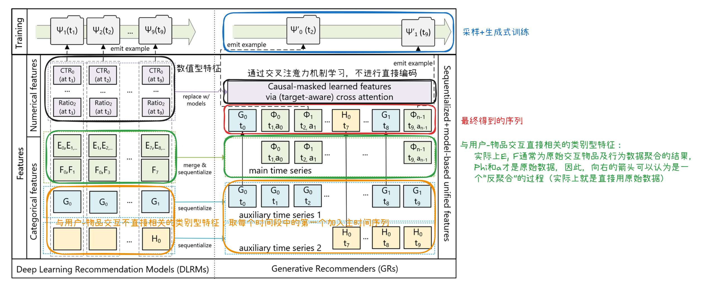
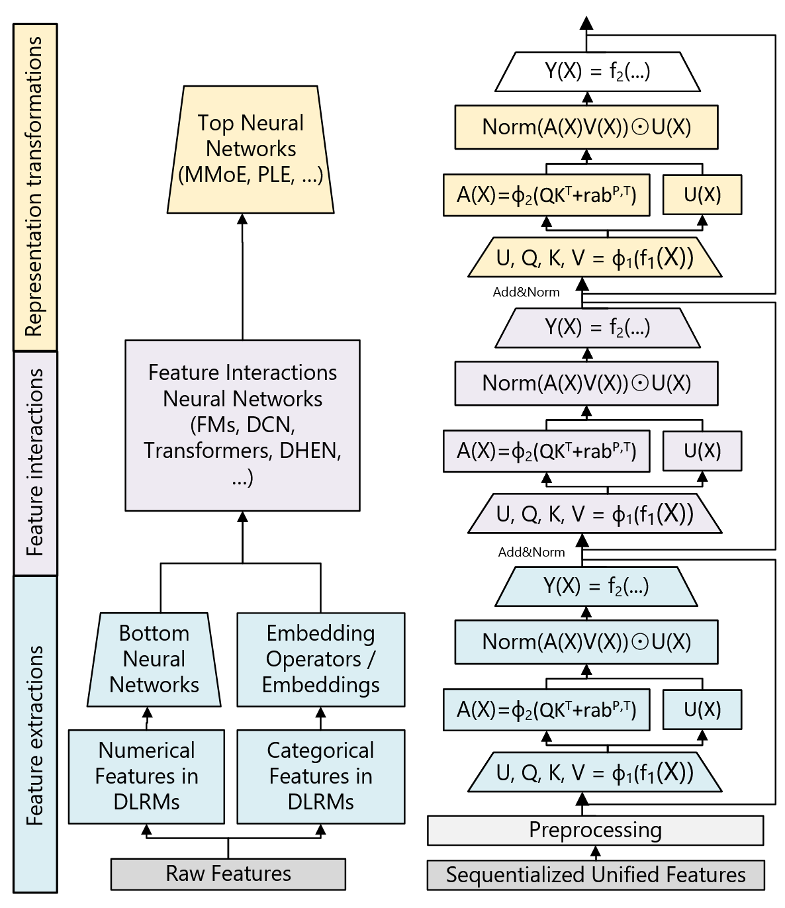

# HSTU (Hierarchical Sequential Transduction Unit)

> PS: [Actions Speak Louder than Words: Trillion-Parameter Sequential Transducers for Generative Recommendations](https://arxiv.org/pdf/2402.17152)论文原文实际上同时介绍了召回阶段和精排阶段的模型，但当前文件夹下的文件主要关注召回阶段的模型。

**HSTU的基本思想**：将所有异构特征（比如用户特征，交叉特征，用户交互过的物品，还有*用户行为*等）**统一**编码为**一个序列**，作为模型的输入，基于seq2seq框架，直接“生成”用户可能感兴趣的物品。注意，这篇文章还引入了用户行为（如点赞、跳过、看完并分享视频，行为未必都是正面反馈），作为一个新的模态，之前的研究基本都忽略了这个模态的信息（因为通常只考虑到用户有正面反馈的物品）。

这是第一个在工业级体量下基于纯序列生成式框架、效果显著超越DLRM的模型。同时，这篇文章还有一个重要发现：生成式推荐模型的模型效果同样遵循scaling law。

## 0. 背景

工业级推荐系统的特征：高基数（类别特征可取的类别数很多）+异构（多种不同特征）特征，每天亿万级的用户操作。

在这个研究提出之前，工业界推荐系统的SOTA模型都属于**深度学习推荐模型**（Deep Learning Recommendation Model, DLRM），这类模型通常会用到大量的异构特征，并用多种类型的复杂网络结构对这些特征进行表示、结合和变换。尽管用到了大量手工设计的特征，并在大规模的数据上进行训练，大多数 DLRM 模型在增加计算资源/参数量时，性能提升效率很低（扩展性差）。

这篇文章使用一个通用的建模框架——**生成式推荐**（Generative Recommendation, GR）将推荐系统中的召回和精排问题重构为**seq2seq问题**，并提出了一个可以处理高基数特征，动态词表（系统中的物品集合通常是会变动的，因为会有物品的上线和下线）的模型架构——HSTU (Hierarchical Sequential Transduction Unit)。

考虑到工业级推荐系统的亿万级别的用户体量，在推荐系统中使用**序列建模**存在如下三大挑战：

1. 推荐系统中的特征（如ID，交叉特征等）没有显式的序列结构
2. 推荐系统的词表（物品池）规模很大且是动态的
3. 计算成本是大规模序列模型训练的主要瓶颈，而在推荐系统中，用户的序列可能很长（关于序列的具体组成，见[1. 序列建模](# 1. 序列建模)），一个推荐系统每天要处理的token数目甚至超过了大语言模型训练1-2个月时间所能处理的token数目

## 1. 序列建模

与DLRM类似，在进行序列建模时能用到的特征也无非只有以下两种：

- **类别型**特征（Categorical features，也叫Sparse features）：比如用户交互过的物品ID，用户使用的语言，用户发送请求时所在的城市等，为便于后续描述，还可以将这些特征进一步分类为如下两种类型

  - 与用户-物品交互直接相关的特征：用户交互过的物品，用户行为
  - 与用户-物品交互不直接相关的特征：用户使用的语言，用户发送请求时所在的城市等

- **数值型**特征（Numerical features，也叫Dense features）：比如用户过去在某个话题下的CTR，特征的衰减计数器等

  > ### 什么是衰减计数器（Decayed Counters）？
  >
  > 这是传统推荐系统中非常常见的一种人工构造的数值特征。
  >
  > #### **1. 衰减计数器的作用**
  >
  > 在推荐系统中，我们需要知道用户对某种东西（比如“篮球”话题）到底有多感兴趣。
  >
  > - **普通计数器 (Standard Counter)：** 只是简单地把用户一辈子点击“篮球”的次数加起来。
  >   - *问题：* 假如你 5 年前是个篮球迷（点了1000次），但最近 3 年一点都不看了。普通计数器依然显示“1000”，系统会误以为你现在还超级喜欢篮球。
  > - **衰减计数器 (Decayed Counter)：** 它认为**“近期的行为比远期的行为更重要”**。它会随着时间的推移，让旧的计数值不断变小（衰减）。
  >
  > #### 2. 衰减计数器的工作方式
  >
  > 假设系统设定每天的权重“衰减”一点点（比如乘以 0.9）。
  >
  > - **第 1 天：** 你点了 1 次篮球。
  >   - *计数器 = 1*
  > - **过了 10 天：** 你没再点过。
  >   - *普通计数器：* 依然是 1。
  >   - *衰减计数器：* 变成了 $1 \times 0.9^{10} \approx 0.35$。
  > - **系统判断：** 衰减计数器通过分数值变低，告诉模型：“这个用户虽然点过，但那是很久以前的事了，现在的兴趣不大了。”

用户-物品交互能够比较自然地形成序列结构（这就构成了GR中的主时间序列）：

- $t_1$时刻，系统给用户推荐了物品$\Phi_1$，用户的行为是$a_1$
- $t_2$时刻，系统给用户推荐了物品$\Phi_2$，用户的行为是$a_2$
- ...

（其中，$a_i$可以是一个multi-hot向量，因为部分行为，如“点赞”和“分享”这两种行为可能同时发生）

这样就用到了类别型特征中与用户-物品交互直接相关的特征，而类别型特征中与用户-物品交互不直接相关的特征通常变化比较缓慢，可以对时间轴进行分段（不同特征的分段方式可以不同），每段仅取这段最开始时的特征值，然后将其作为一个token插入主时间序列中，并不会导致主时间序列的长度明显增加。

对于数值型特征，由于这些特征变化通常很快（可能每次交互都要变化，比如CTR，衰减计数器），将每次变化后的特征都加入序列在计算和存储上通常都是不可接受的。但是我们注意到这些特征其实都是通过对类别型特征进行某些聚合操作得到的，而这些类别型特征已经在序列中进行编码了，通过一些表示能力强的聚合方式（如target-aware cross attention），实际上也能捕捉到这些特征（如果这些特征确实对于预测有帮助）。因此，可以直接忽略这些特征，或者说让模型自己去学习这些特征。

这个序列建模方式通过选定不同的输入输出，既可以用于召回问题建模，也可以用于重排问题建模。

对于召回问题，如果用户一共与 $n_c$ 个物品进行了交互，构造模型输入输出（为简化表示，这里忽略了与用户-物品交互不直接相关的类别特征）如下

- 输入：$(\Phi_0, a_0), (\Phi_1, a_1), \ldots, (\Phi_{n_c-1}, a_{n_c-1})$
- 输出：$\Phi'_1, \Phi'_2, \ldots, \Phi'_{n_c-1}, \varnothing$，其中 $a_i$ 是正向反馈时 $\Phi_i'=\Phi_i$，否则$\Phi_i'=\varnothing$

在进行序列生成时需要用到因果掩码，以防止泄露未来信息。上面的输入输出的含义是：在时间步 $t$，根据 $t$ 及之前的用户历史及用户反馈，预测用户下一个感兴趣的物品，如果实际的下一个物品用户不感兴趣（或为与用户-物品交互不直接相关的类别特征构成的token），预测结果不会计入loss，不影响反向传播。

### 生成式训练

工业级推荐系统通常采用**流式**方式进行训练，每个新样本生成后就会被用于训练。在传统的*impression-level*训练中，即使是之前已经被模型“见过”的序列，一旦新增了token，就可以构造一个新的样本。因此，对用户 $i$，如果他的交互序列长度为 $n_i$，这个序列实际上贡献了 $n_i$ 个样本，即长度分别为 1，2，...，$n_i$ 的序列样本，而对每个样本使用自注意力的时间复杂度是关于序列长度的平方级的，如果单独处理每个样本，单个用户 $i$ 的时间复杂度就将达到 $O(n_i^3)$。考虑到单个用户的序列可能很长（$n_i$可能很大），这个复杂度是不可接受的。因此，需从*impression-level training*转向*generative training*的思路，对长度为 $n_i$ 的序列，使用 $0<s_u(n_i)<1$ 的采样率，即采样 $n_i s_u(n_i)$ 个token作为划分点，把序列划分为 $n_i s_u(n_i)$ 个，每个序列用于构造一个样本的输出，这样encoder的成本就可以在多个预测目标token之间进行摊销，相当于样本个数从 $n_i$ 降低到 $n_i s_u(n_i)$，当 $s_u(n_i)=1/n_i$ （可以通过仅在用户请求/会话结束时才构造样本来实现，因为每次请求/会话都会包含多次交互）时，就将复杂度降低了一个数量级。

> #### 什么是流式训练？
>
> 流式训练是一种在线机器学习范式（Online Learning Paradigm），主要用于处理无限、连续且随时间动态生成的数据流。与传统的离线多轮训练（Multi-epoch Batch Training）不同，流式训练遵循以下核心原则：
>
> 1. **严格的时序因果性 (Strict Temporal Causality)：** 模型必须严格按照事件发生的自然时间顺序处理样本，严禁利用未来时刻的信息来预测或训练当前时刻（即禁止数据穿越）。
> 2. **单次遍历机制 (One-pass Constraint)：** 数据样本仅被模型“观测”一次。在完成前向传播计算损失并反向传播更新参数后，该样本即被丢弃，不再进入后续的训练循环。这意味着模型无法通过重复迭代（Re-visiting）旧数据来优化收敛。
> 3. **非平稳分布适应 (Adaptation to Non-stationary Distributions)：** 鉴于推荐系统中的数据分布（如用户偏好、物品流行度）随时间发生显著的协变量偏移（Covariate Shift）或概念漂移（Concept Drift），流式训练要求模型具备持续学习（Continuous Learning）的能力，以实时捕捉动态变化的潜在模式，而非拟合静态的历史分布。
>
> #### 为什么使用流式训练？
>
> - 每天都有大量数据涌入，仅在新增的数据上进行训练就需要大量时间，很难有时间再去“复习”之前的样本
> - 用户的兴趣变化很快，较长时间前的用户行为可能已经不能代表用户现在的兴趣了

## 2. 网络结构

为了让GR能在工业级的推荐系统上scale up，并能适应海量动态的词表，作者设计了一种新的高效的encoder——Hierachical Sequential Transduction Unit (HSTU)。HSTU由多个相同的layer堆叠而成（堆叠时还用到了残差连接）。每个layer由3个sub-layer组成：

1. Pointwise Projection:
   $$
   U(X),V(X),Q(X),K(X)={\rm Split}(\phi_1(f_1(X)))
   $$
   相比于Transformer对 $Q$, $K$, $V$ 分别维护一个权重矩阵，这里直接使用一个大的权重矩阵（相当于对 $W^Q$, $W^K$, $W^V$ 进行拼接，这样计算更高效一些，就与Transformer中不对每个头分别维护一个权重矩阵，而是将所有头的权重矩阵拼成一个矩阵的作用是一样的，在多头的情况下，这里实际上是对头 + $Q,K,V$ 都进行了拼接），然后再从计算结果中分离出各个部分。具体来说，对长度为 $N$ 的序列，嵌入的维度为 $d$，query和key向量的维度为 $d_{qk}$（query向量与key向量的维度一定相同，因为后续要进行内积操作），value向量的维度为 $d_v$，且使用$h$个头的情况下：$X$ 的shape是 $[N,d]$，大权重矩阵的shape是 $[d, h\times (2d_{qk}+d_v)]$，得到的tensor的shape是 $[N,h\times (2d_{qk}+d_v)]$，再分解为 $Q(X)$ ($[N,h\times d_{qk}]$)，$K(X)$ ($[N,h\times d_{qk}]$) 和 $V(X)$ ($[N,h\times d_v]$)，再通过 $U(X)=\phi_1(V(X))$ 得到 $U(X)$。这里在实际操作时通过定制的GPU内核进行了优化，将这些操作高度融合，减少中间计算结果对显存的占用。

   这里用到的非线性函数 $\phi_1$ 为SiLU。

2. Spatial Aggregation:
   $$
   A(X)V(x)=\phi_2(Q(X)K(X)^T+{\rm rab}^{p,t})V(X)
   $$
   整体的思路与Transformer计算自注意力的机制基本一致，这里的 ${\rm rab}^{p,t}$ 是相对注意力偏置，使用序列位置距离（索引差）$p$ 和时间戳距离（时间差）$t$ 编码相对位置信息。作者在 *Table 9* 中提到不同的注意力头之间的相对注意力偏置是共享的。

   这里用到的非线性函数 $\phi_2$ 为SiLU。

3. Pointwise Transformation:
   $$
   Y(X)=f_2({\rm Norm}(A(X)V(X))\odot U(X))
   $$
   这里的Norm是层归一化，而不是经典的softmax，这出于以下两个原因：

   1. target之前与之相关的**数据点的个数**也是衡量用户偏好强度的一个重要特征，如果使用softmax，所有权重总和始终为1，就无法体现相应的强度特征
   2. 工业级推荐系统中的词表是动态的，使用softmax不太合适

> #### 什么是SiLu？
>
> $$
> \text{SiLU}(x) = x \times \sigma(x)
> $$
>
> 它长得像 ReLU，但在 0 附近是平滑的曲线，并且允许少量负值通过。
>
> - $x$ 越大，开关开得越大（接近 1），信号几乎原样通过。
>
> - $x$ 越小（负数），开关关得越紧（接近 0），信号被抑制并趋近于 0。

### 与DLRM的对比

DLRM有三个主要的阶段：

- **特征提取**：通常都是通过对类别型特征的embedding表示进行某种pooling，这在HSTU层中也是可以实现的。
- **特征交互**：DLRM最关键的部分，通常是通过FM或者其它变种的网络结构实现，HSTU通过attention机制可以直接实现特征的交互。
- **表示变换**：DLRM中通常通过MoE等网络结构实现，HSTU中用到的门控操作可以实现类似的效果。

HSTU编码器将DLRM中异构的网络模块使用一个统一的模块（HSTU模块）代替。这个模块能实现与DLRM中三个阶段类似的功能。

### 改善模型效率

为了使模型的效率更高、控制模型训练所需的显存，模型中还加入了以下改进措施：

#### 改进一：提升并利用稀疏性

这里的稀疏性指的是用户序列长度的稀疏性：用户历史序列长度通常是一个有偏的分布，大部分用户的序列长度较短，但是存在长尾区域。使用分组矩阵乘法（Grouped GEMMs），不对长度不一的序列进行padding，而是把不同长度的序列看作是一组不同大小的矩阵乘法（通过定制化的GPU内核实现），避免显存的浪费。

训练时，还会进一步通过Stochastic Length算法，对序列中的部分token进行随机丢弃，以提升上述稀疏性。这是基于一个关键洞察：**用户的行为在时间上具有高度的重复性**，因此丢失部分token损失的信息并不多。

SL算法的具体做法：根据序列长度动态决定保留多少token

1. **短序列：** 如果用户历史很短（比如少于 $N_c^{\alpha/2}$），全部保留，不丢弃。
2. **长序列：** 如果用户历史很长，就按概率**随机采样一个子序列**（长度为 $N_c^{\alpha/2}$）。序列越长，被丢弃的比例越高。

其中 $N_c$ 为最长序列的长度，$0<\alpha<2$ 为超参数，当 $\alpha=2$ 时，不进行任何丢弃。

#### 改进二：减少激活内存占用

不同于大语言模型中较小的batch size，**推荐系统中的batch size通常很大**，易导致中间的激活内存占用很高。为减少激活内存占用，需要减少中间状态的显存占用。

> **激活内存**：前向传播过程中产生并在反向传播时需要用到的中间激活值（activations）所占用的显存/内存。这里主要指显存。

> ##### 为什么推荐系统中的batch size通常较大？
>
> 1. 提高训练吞吐量
> 2. 提高模型质量

这主要是通过下面两个方式实现：

1. 相比于Transformer，HSTU将模型中的linear层的数目从6层降到了2层（$f_1$ 和 $f_2$），减少了中间状态

   > ##### 为什么Transformer的线性层有6层？
   >
   > 在标准的 Transformer 结构中，每一个 Block 由两个子层组成：**Self-Attention** 和 **FFN**。
   >
   > 这 6 个线性层分别是：
   >
   > - **Attention 部分 (4层)：**
   >   1. **$W_Q$ (Query Projection):** 生成 Query 向量。
   >   2. **$W_K$ (Key Projection):** 生成 Key 向量。
   >   3. **$W_V$ (Value Projection):** 生成 Value 向量。
   >   4. **$W_O$ (Output Projection):** Attention 算完后，将结果映射回原来的维度。
   > - **FFN (Feed-Forward Network) 部分 (2层)：**
   >   5. **$W_1$ (Up Projection):** 将维度放大（通常是 $4d$），经过激活函数。
   >   6. **$W_2$ (Down Projection):** 将维度缩回（回到 $d$）。
   >
   > **合计：4 + 2 = 6 个线性层。**

2. 使用rowwise AdamW优化器，并将优化器的状态存储在DRAM而不是GPU上。

## 3. 业务洞察

1. DLRM在计算量和参数量达到一定规模后性能就会饱和，但是生成式模型存在与大语言模型类似的scaling law，与大语言模型不同的是，其中序列长度的影响尤其显著，也就是对序列长度进行scale up对模型的效果提升有明显作用。
2. 工业级的推荐系统中核心的召回和排序任务在给定一个合适的新的特征空间后都可以被建模为序列问题；这种这种范式使我们能够系统地利用特征、训练和推理中的冗余来提高效率，训练参数规模更大的模型。
3. 在新提出的这个GR框架中，对异质的特征空间进行序列化和统一，这个新方法在序列长度区域无穷时，就是DLRM全特征空间的近似。更重要的是这种建模方法可以让模型的训练过程是序列式的，通过使用生成式训练，可以在相同的计算量的前提下训练更高数量级的数据。

## 4. 代码实现

可查看官方repo: [Generative Recommenders](https://github.com/meta-recsys/generative-recommenders)

## 5. 参考内容链接

1. [Actions Speak Louder than Words: Trillion-Parameter Sequential Transducers for Generative Recommendations](https://arxiv.org/pdf/2402.17152)
2. [FunRec 推荐系统 2.3.2.2节](https://datawhalechina.github.io/fun-rec/chapter_1_retrieval/3.sequence/2.generateive_recall.html)

---

## 6. 附：GR与以往的生成式推荐模型的区别

这里描述的区别不仅局限于召回任务，也包括重排任务：

> 之前的序列建模方式通常有以下特点：
>
> - 忽略除用户交互物品外的所有特征。而在GR框架中，类别特征被当作token，数值特征可以通过target-aware的交叉注意力机制得到。
> - 传统的序列模型在进行序列建模时、生成用户表示时都不会考虑到target（候选物品）。GR通过结合用户的action这一新的模态，能够通过因果、自回归的形式使用target-aware的注意力。
> - 召回和精排任务无法使用一个统一的框架进行建模。GR实际上是对推荐内容和用户行为的联合分布的概率密度函数进行了建模，然后召回任务用到了给定交互过程来推荐下一个物品的条件分布，精排用到了给定交互过程预测用户的偏好程度。另外，这个建模方式还可以得到推荐顺序，而不仅仅是一个无序的推荐物品集合，这一点将在未来的研究中继续探索。

