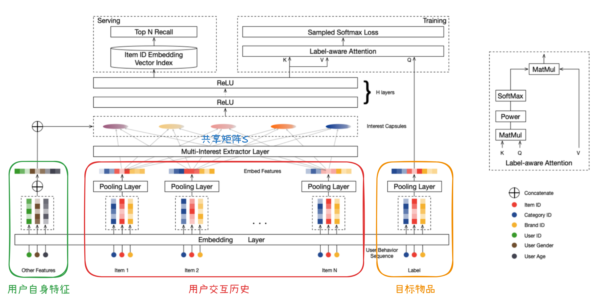

# MIND (Multi-Interest Network with Dynamic Routing)

**MIND的基本思想**：使用**多个**向量而不是一个单一向量来表示用户的多个兴趣层面（比如，用户可能既对服装感兴趣又对数码产品感兴趣）。简单来说，它会自动把用户行为按照兴趣类型进行分组，并为每组兴趣生成一个专门的兴趣向量。

MIND的整体网络架构组成：

- Embedding层
- 多兴趣提取层
- Label-Aware注意力层

## 1. 问题描述

考虑用户集合 $\mathcal{U}$ 和 物品集合 $\mathcal{I}$，在召回阶段，需要为每个用户 $u\in \mathcal{U}$ 从上亿物品中召回约上千个物品。每个输入可表示为一个三元组的形式：$(\mathcal{I_u}, \mathcal{P_u}, \mathcal{F_i})$，其中 $\mathcal{I_u}$ (user behavior) 表示用户 $u$ 交互过的物品集合，$\mathcal{P_u}$ (user profile) 是用户自身的特征（如性别和年龄），$\mathcal{F_i}$ (label item) 是目标物品自身的特征（如物品ID和类别ID）。

*注意：下面的这段描述是从**推理阶段**的角度来陈述的。*

MIND的核心任务是学习一个从原始特征到用户表征的映射函数，如下
$$
V_u = f_{user}(\mathcal{I_u}, \mathcal{P_u})
$$

这里的 $V_u = \left( \vec{\mathbf{v}}_u^1, \dots, \vec{\mathbf{v}}_u^K \right) \in \mathbb{R}^{d \times K}$ 用K个 $d$ 维向量而不是一个向量来对用户进行表示（$K=1$ 时就类似于YouTube DNN）。

目标物品 $i$ 则通过另一个函数进行映射，表示为 $\vec{\mathbf{e}}_i=f_{item}(\mathcal{F}_i)$，是一个 $d$ 维向量。

在通过上述方式分别获取到表示用户 $u$ 的向量组和表示物品 $i$ 的向量后，根据如下方式对用户 $u$ 和物品 $i$ 的“连接”进行打分，为用户 $u$ 召回分数最高的 $N$（$N$ 的取值是预先设置好的）个候选物品：

$$
f_{score}(V_u, \vec{\mathbf{e}}_i) = \max_{1 \le k \le K} \vec{\mathbf{e}}_i^\mathrm{T} \vec{\mathbf{v}}_u^k
$$

注意这里有 $\max$ 操作，因为应该用与物品 $i$ 最相似的兴趣 $k$ 对应的向量来计算相似性，比如为用户 $u$ 计算对手机的召回分数时，应该用数码产品对应的兴趣向量，而不是服装对应的兴趣向量，这样的计算结果才是有意义的。

## 2. 网络结构

### Embedding & Pooling Layer

$\mathcal{I_u}, \mathcal{P_u}, \mathcal{F_i}$中的特征通常都包含高基数类别特征（特别是ID特征），因此使用常见的embedding技术将这些特征嵌入到低维的稠密向量中，以减少参数数目，具体处理方式如下：

- 对 $\mathcal{P_u}$: 用户的ID及其它用户特征（如年龄、性别等）经过embedding后再进行**拼接** (concatenation)，得到用户向量 $\vec{\mathbf{p}}_u$。
- 对 $\mathcal{F_i}$: 物品的ID及其它物品特征（如品牌、店铺等）经过embedding后再进行**平均池化** (average pooling)，得到物品向量 $\vec{\mathbf{e}}_i$。
- 对 $\mathcal{I_u}$: 会收集集合中物品对应的物品向量，得到$\mathrm{E}_u = \{ \vec{\mathbf{e}}_j, j \in \mathcal{I}_u \}$。

### Multi-Interest Extractor Layer

这里的设计借鉴了胶囊网络 ([Sabour *et al.*, 2017](https://arxiv.org/pdf/1710.09829 "")) 的动态路由机制。

> #### 动态路由机制
>
> 在胶囊网络中，动态路由机制的目标是**在给定low-level的胶囊后，计算出high-level的胶囊**（所谓的胶囊就是向量，不同于传统的神经网络中每个神经元对应一个标量，胶囊网络中每个胶囊对应一个向量）。
>
> 具体来说，下层有 $m$ 个胶囊，每个胶囊是一个 $N_l$ 维度的向量，上层有 $n$ 个胶囊，每个胶囊是一个 $N_h$ 维度的向量，下层第 $i$ 个胶囊 $\vec{\mathbf{c}}_i^l$ 与上层第 $j$ 个胶囊 $\vec{\mathbf{c}}_j^h$ 之间的动态路由logit就是
> $$
> b_{ij}=(\vec{\mathbf{c}}_j^h)^T S_{ij} \vec{\mathbf{c}}_i^l
> $$
> 其中 $S_{ij}$ 是要学习的权重矩阵，首次计算时没有 $\vec{\mathbf{c}}_j^h$，可以直接将 $b_{ij}$ 初始化为0。
>
> 每个上层的胶囊 $\vec{\mathbf{c}}_j^h,j=1,2,...,n$ 都会受到下层所有胶囊的影响，前面得到的logit就决定了下层第 $i$ 个胶囊对上层第 $j$ 个胶囊的影响程度：
> $$
> w_{ij} = \frac{\exp(b_{ij})}{\sum_{k=1}^{m} \exp(b_{ik})}
> $$
> 然后计算 $\vec{\mathbf{z}}_j^{\,h} = \sum_{i=1}^{m} w_{ij}\, S_{ij}\, \vec{\mathbf{c}}_i^{\,l}$，再进行squash操作（$\vec{\mathbf{c}}_j^{\,h} = \text{squash}(\vec{\mathbf{z}}_j^{\,h}) = \frac{\|\vec{\mathbf{z}}_j^{\,h}\|^2}{1 + \|\vec{\mathbf{z}}_j^{\,h}\|^2} \frac{\vec{\mathbf{z}}_j^{\,h}}{\|\vec{\mathbf{z}}_j^{\,h}\|}$）就得到了更新后的 $\vec{\mathbf{c}}_j^{\,h}$。这样就完成了一次迭代。经过给定的迭代次数后，$\vec{\mathbf{c}}_j^{\,h}$ 就固定了，作为后面的层的输入。
>
> #### 为什么借鉴胶囊网络？
>
> 在胶囊网络中，每个胶囊的方向代表一个特征，这个向量的长度（模长）代表这个特征存在的概率。在推荐系统的召回任务中，我们关心的就是用户的各个兴趣的表示以及兴趣是否存在的问题，因此有如下对应关系：
>
> - 每个胶囊 $\leftrightarrow$ 用户的某个兴趣特征（比如：喜欢数码产品）
> - 胶囊的模长 $\leftrightarrow$ 该兴趣存在的可能性
>
> 注意：我们已知的是物品向量，希望得到的是用户的兴趣表示，因此每个物品向量对应下层的每个胶囊，用户的每个兴趣表示是上层的每个胶囊。

为了适应召回任务，对原始的动态路由机制进行了如下改动：

- 共享 $S_{ij}$ 矩阵，即所有的 $S_{ij}$ 都相同（等于 $S$）。原因有两个：

  - 对不同的用户 $u$，$\mathcal{I_u}$ 的大小可能差别很大（$m$ 的差别可能很大），如果 $S_{ij}$ 不共享，泛化性能一般不好
  - 我们希望各个胶囊是在同一个向量空间的，但是不同的 $S_{ij}$ 矩阵会将胶囊映射到不同的向量空间

  这样，路由的logit就可以通过如下方式计算：
  $$
  b_{ij} = \vec{\mathbf{u}}_j^T S \vec{\mathbf{e}}_i, \quad i \in \mathcal{I}_u, j \in \{1, \dots, K\}
  $$
  其中 $\vec{\mathbf{u}}_j$ 是表示用户兴趣 $j$ 的胶囊，$\vec{\mathbf{e}}_i$ 是之前提到过的物品向量（对应于物品胶囊），两个向量的维度都是 $d$。

- 随机初始化 $b_{ij}$。原始的做法是将所有 $b_{ij}$ 都初始化为0，但是由于 $S$ 是共享的，这会导致后续在更新时所有的胶囊取值总是相同，因此用 $b_{ij}\sim N(0, \sigma^2)$ 进行随机采样。

- 动态的兴趣胶囊个数。有的用户的兴趣可能本身就比较“广泛”，其它用户感兴趣的内容可能相对单一，因此不同的用户的 $K$ 的取值通常很难是完全一样的，使用一个简单的启发式来自适应地调整 $K$，为不同的用户 $u$ 设置不同的 $K_u'$：
  $$
  K'_u = \max(1, \min(K, \log_2(|\mathcal{I}_u|)))
  $$
  对于兴趣较为单一的用户，这可以节省很多的计算和存储开销。

### Label-aware Attention Layer

每个胶囊对应的向量代表用户的一个兴趣方面，在评估用户对某个具体物品的兴趣时，应该使用最相关的那个胶囊，MIND通过label-aware attention层（基于尺度归一化后的向量内积）来找到对应的胶囊。

对给定的target item $i$，将其对应的物品向量 $\vec{\mathbf{e}}_i$ 作为query，将得到的每个胶囊向量 $\vec{\mathbf{u}}_j$ 与 $\vec{\mathbf{p}}_u$ 拼接得到的向量 $\vec{\mathbf{v}}_u^j$ 作为keys和values，得到关于这个物品的用户兴趣的最终表示向量：
$$
\begin{aligned} \vec{\mathbf{v}}_u &= \text{Attention}(\vec{\mathbf{e}}_i, V_u, V_u) \\ &= V_u \text{softmax}(\text{pow}(V_u^\mathrm{T} \vec{\mathbf{e}}_i, p)) \end{aligned}
$$
其中 $p$ 是用于调整注意力的“软硬程度”的超参数，当 $p$ 趋于无穷大时，logit最大的胶囊的权重几乎为1，其它的胶囊几乎完全被忽略，实验测试发现此时能很快收敛；$V_u = \left( \vec{\mathbf{v}}_u^1, \dots, \vec{\mathbf{v}}_u^K \right) \in \mathbb{R}^{d \times K}$。

### Training

在得到最终的用户兴趣向量 $\vec{\mathbf{v}}_u$ 和物品向量 $\vec{\mathbf{e}}_i$ 后，可以计算用户 $u$ 与物品 $i$ 的交互概率（由于物品总数很大，实际上会用sampled softmax来替代softmax）：
$$
\operatorname{Pr}(i|u) = \operatorname{Pr}(\vec{\mathbf{e}}_i|\vec{\mathbf{v}}_u) = \frac{\exp \left(\vec{\mathbf{v}}_u^\mathrm{T} \vec{\mathbf{e}}_i\right)}{\sum_{j \in \mathcal{I}} \exp \left(\vec{\mathbf{v}}_u^\mathrm{T} \vec{\mathbf{e}}_j\right)}
$$
MIND的总的训练目标是最大化下面的目标函数：
$$
L = \sum_{(u, i) \in \mathcal{D}} \log \operatorname{Pr}(i|u)
$$
其中 $\mathcal{D}$ 是训练数据中所有已发生的用户-物品交互。

### Inference (Serving)

实际推理时，除了label-aware attention层，MIND网络的其它部分仅与用户相关，对每个用户，计算完 $V_u = \left( \vec{\mathbf{v}}_u^1, \dots, \vec{\mathbf{v}}_u^K \right)$ 后，可以用ANN找到其top-N的最近邻，就是我们要推荐的物品。具体来说，我们要找的就是下面的分数（近似）最大的N个物品：
$$
f_{score}(V_u, \vec{\mathbf{e}}_i) = \max_{1 \le k \le K} \vec{\mathbf{e}}_i^\mathrm{T} \vec{\mathbf{v}}_u^k
$$
注意：每当用户 $u$ 有新的交互行为后，他的交互历史 $\mathcal{I_u}$ 就会变化，从而会有新的用户表示向量，MIND由此可以进行**实时**的个性化推荐。推理阶段是没有计算label-aware attention的。

## 3. MIND网络与其它网络的关联

1. *YouTube DNN*: 当MIND的胶囊数 $K=1$ 时，MIND就退化为 *YouTube DNN*。
2. *DIN*: DIN和MIND都致力于捕捉用户兴趣的多个层面，但是DIN是在物品层面使用了注意力机制，而MIND是在兴趣层面使用了注意力机制；DIN主要用于重排阶段，此时处理的是千级的物品，但是MIND通过对用户和物品的表示进行解耦，可以用于需要面对亿级产品的召回问题。

## 4. 代码实现Comments

为突出主要逻辑，模型和输入有一定的简化：

1. 使用的是[Amazon Review](https://nijianmo.github.io/amazon/index.html)的数据，当前仅使用了用户与物品交互的csv数据表，表中的列为item, user, rating, timestamp。实际场景中应使用物品全集（[Amazon Review](https://nijianmo.github.io/amazon/index.html)中的metadata）作为召回的候选集。
2. 当前没有用到用户除ID外的特征（代码中已相应的处理逻辑，只是没有使用到），也没有用到物品除ID外的特征（这部分只需在模型中为每个类别特征再分别创建Embedding矩阵，所有特征Embedding后再增加一个平均池化的处理即可）。
3. 为便于构造样本，当前的数据划分方式中，训练集和测试集中的user没有重叠，会导致user profile实际上没有发挥作用。
4. 召回topK个物品时，计算了所有候选物品的logit，没有用ANN。

## 5. 参考内容链接

1. [Multi-Interest Network with Dynamic Routing for Recommendation at Tmall](https://arxiv.org/pdf/1904.08030)
2. [FunRec推荐系统 2.3.1.1节]([2.3.1. 深化用户兴趣表示 — FunRec 推荐系统 0.0.1 documentation](https://datawhalechina.github.io/fun-rec/chapter_1_retrieval/3.sequence/1.user_interests.html))
3. https://github.com/Wang-Yu-Qing/MIND
4. https://github.com/danielhavir/capsule-network

