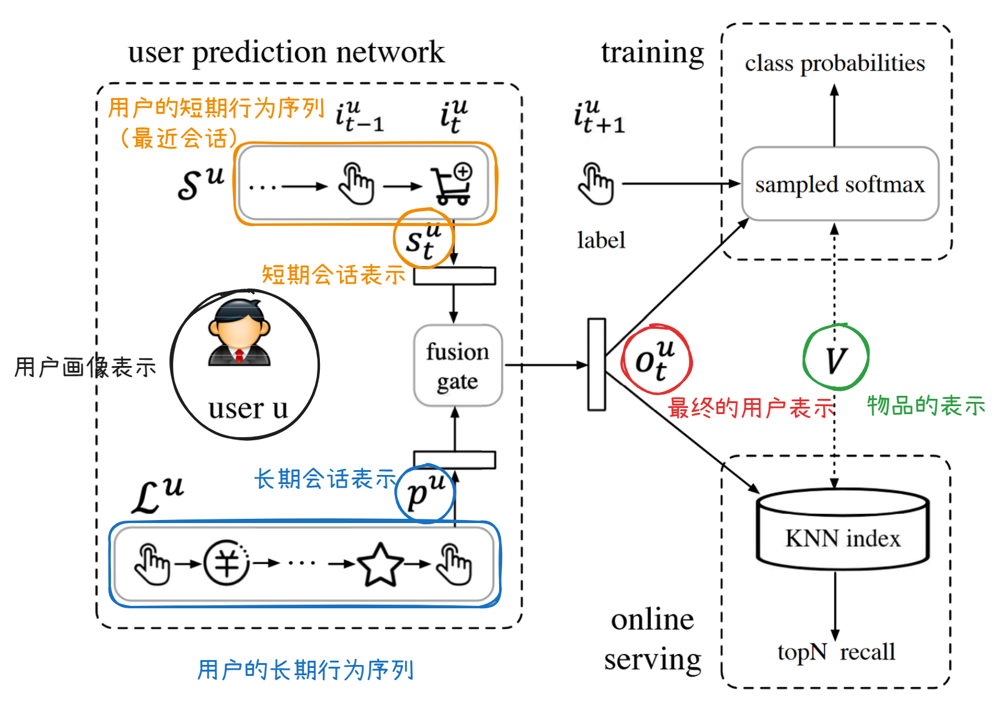
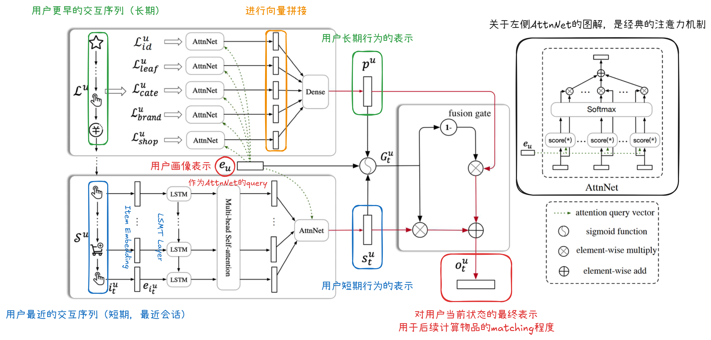

# SDM: Sequential Deep Matching Model

:warning: **如有无法正常渲染的公式，可移步至同文件夹下的jupyter notebook**

**SDM的基本思想**：既考虑到用户兴趣/关注点的多样性，又考虑到交互的时效性和时序性。

## 0. 背景

基于物品的协同过滤是工业界常见的matching方法，但是这些方法无法捕捉用户兴趣的动态性，容易导致推荐的同质化。

相比于已有的一些sequence-aware的推荐方法，SDM引入了**多头注意力机制**和**门控融合机制**两大组件，解决了两个真实存在的问题：

1. 用户在一次会话中可能存在**多个**兴趣倾向（比如，用户同时关注品牌、颜色、店铺商誉等）$\rightarrow$ 使用**多头自注意力机制**捕捉多兴趣倾向
2. **长期**偏好信息无法与当前会话的**短期**兴趣倾向有效融合：由于长期行为是多样化的、复杂的，应该仅考虑与短期会话高度相关的部分。$\rightarrow$ 使用**门控机制**来融合长短期偏好

>### 会话(Session) & 长期行为 & 短期行为 含义
>
>用户在使用淘宝时，会产生很长的交互行为序列，这些序列是由会话（Session）组成的。
>
>每个会话是在一个给定时间范围内的用户行为序列。用户在每个会话中用户通常有一个清晰、唯一的购物需求（如果需求切换，就是一个新的会话）。
>
>如果直接对用户的全行为序列（实际上由许多会话组成）进行建模，忽略内在的“会话”结构，会损害性能。因此将用户最近的一些会话作为短期行为，其它更早的一些会话作为长期行为，对这两部分进行分别建模。

## 1. 问题描述

$\mathcal{U}$ 是用户集合，$\mathcal{I}$ 是物品集合。模型关心的是在时间 $t$，用户 $u\in \mathcal{U}$ 是否会和物品 $i\in \mathcal{I}$ 交互。通过对用户交互过的物品*按照交互时间进行排序*，可以得到其*最近*的会话，具体的会话生成规则如下：

- 后端系统记录的具有同样的会话ID的交互属于同一个会话
- 时间差短于给定时间（如10min）的相邻交互会被合并到同一个会话中
- 一个会话的最大长度是50（50个物品），如果超过这个长度，开启一个新会话

将用户 $u$ 最近的会话视为短期行为，表示为 $\mathcal{S}^u=[i_1^u,...,i_t^u,...,i_m^u]$，其中 $m$ 是序列的长度，$i_t^u$ 表示用户 $u$ 在会话中第 $t$ 个交互的的物品。在过去7天中发生在 $\mathcal{S}^u$ 之前的行为属于长期行为，用 $\mathcal{L}^u$ 表示。给定用户 $u$ 的 $\mathcal{S}^u$ 和 $\mathcal{L}^u$，我们要为其推荐可能感兴趣的下一个的物品。

## 2. 网络结构

类似于YouTubeDNN，SDM总体也是采用双塔模型的结构。损失函数同样使用经典的sampled-softmax + cross-entropy。

### 整体结构概览

### Embedding Layer

由于不同顾客的关注点（品牌、店铺、价格等）通常不同，以及海量物品所导致的稀疏性，仅使用物品ID这个feature对物品进行嵌入的效果通常不够好。因此会构建物品的辅助信息 (Side Information) 集合 $\mathcal{F}$，包括 *item ID*，*leaf category*，*first level category*，*brand*，*shop* 等辅助信息，将这些特征嵌入后的结果进行拼接，得到每个物品 $i$ 的表示 $\text{concat}(\{\boldsymbol{e}_i^f | f \in \mathcal{F}\})$。类似地，也可以构建用户的辅助信息集合 $\mathcal{P}$，包括 *age*，*gender*，*life stage* 等辅助信息，将这些特征嵌入后的结果进行拼接，得到每个用户 $u$ 的表示$\text{concat}(\{\boldsymbol{e}_{u}^{p} | p \in \mathcal{P}\})$。

### LSTM Layer

以往研究显示，RNN（如LSTM）非常适合对会话级别的短期行为序列进行建模。在RNN的基础上叠加多头注意力机制，可以捕捉多个兴趣维度的信息，同时，还可以更准确地建模用户的偏好、过滤随机的点击行为。这里每个时间步的输入就是短期行为序列 $\mathcal{S}^u$ 中用户交互过的物品经过Embedding Layer得到的表示。论文作者在4.4节中还提到在堆叠LSTM Layers时，中间还加入了残差连接。

输入：${\rm Embeded}(\mathcal{S}_t^u)=[\boldsymbol{e}_{i_1^u},...,\boldsymbol{e}_{i_t^u}]$

输出：${\rm LSTM}({\rm Embeded}(\mathcal{S}^u))=[\boldsymbol{h}_1^u,...,\boldsymbol{h}_t^u]$

### 短期行为建模

网络中用到了两种类型的注意力：

1. 多头自注意力（Multi-head Self-Attention）
2. 以用户画像为query的注意力（User Attention）

#### Multi-head Self-Attention

用户在进行网购时，经常会不时浏览一些无关的物品，这些随意点击会对LSTM学到的每个时间步的隐变量（hidden state）产生影响。这里使用自注意力网络（通过对每个时间步分配不同的注意力权重）来降低这些无关行为的影响，并使用多个头，来建模用户的多个兴趣点（用户在选购时可能有多重的考虑因素）。

> 自注意力机制是注意力机制的一种特殊形式，将序列自身作为query, key和value。

输入：${\rm LSTM}({\rm Embeded}(\mathcal{S}^u))=[\boldsymbol{h}_1^u,...,\boldsymbol{h}_t^u]$

输出：${\rm MHA}({\rm LSTM}({\rm Embeded}(\mathcal{S}^u)))=[\boldsymbol{\hat{h}}_1^u,...,\boldsymbol{\hat{h}}_t^u]$

作者在4.4节提到，在通过MHA后，也使用了与Transformer类似的残差连接和层归一化（layer norm）。

#### User Attention

在自注意力机制之后，还加入了user attention，将用户表示作为query，经过自注意力编码的序列作为key和value，可以得到最终的短期兴趣编码。

输入：${\rm MHA}({\rm LSTM}({\rm Embeded}(\mathcal{S}^u)))=[\boldsymbol{\hat{h}}_1^u,...,\boldsymbol{\hat{h}}_t^u]$（key, value）和 $\boldsymbol{e}_{u}$

输出：短期行为表示 $\boldsymbol{s}_t^u = \sum_{k=1}^t \alpha_k \boldsymbol{\hat{h}}_k^u=\frac{\exp(\boldsymbol{\hat{h}}_k^{uT} \boldsymbol{e}_u)}{\sum_{k=1}^t \exp(\boldsymbol{\hat{h}}_k^{uT} \boldsymbol{e}_u)}\boldsymbol{\hat{h}}_k^u$

### 长期行为建模

用户的长期行为可能也是受到多个因素影响的：用户可能经常在某几家店铺下单，或经常购买同一类型的物品。因此，$\mathcal{L}^u$ 是多个序列的集合，每个序列是物品的一类特征（与[Embedding Layer](# Embedding Layer)中的物品辅助信息集合 $\mathcal{F}$ 对应），即 $\mathcal{L}^u=\{\mathcal{L}_f^u|f\in \mathcal{F}\}$。比如 $\mathcal{L}_{shop}^u$ 表示用户 $u$ 在过去一周交互过的商店序列。每个序列中的每个时间步的输入都被嵌入，然后通过注意力机制聚合为一个向量（与短期行为的User Attention类似，使用用户表示作为query，序列作为key和value），然后将每个序列聚合得到的向量进行拼接后，再经过一个全连接层，就得到长期行为表示 $\boldsymbol{p}^u$。

**注意**：作者明确指出，这里对特征 $f$ 进行embedding时用到的参数与[Embedding Layer](# Embedding Layer)中对特征 $f$ 进行embedding时用到的参数是**相同**的。虽然论文3.3节用 $d_f$ 表示特征 $f$ 嵌入后的维度，但是在3.6节又使用 $d$ 表示特征 $f$ 嵌入后的维度，但是考虑到后面还要进行user attention，只能有 $d_f=d$。

### 门控融合模块

如果仅对长短期的表示进行拼接或加权求和（如注意力机制），信息融合的效果一般，使用门控进行融合的表示能力更强。

门控融合模块的输入：用户画像表示 $\boldsymbol{e}_{u}$，长期行为表示 $\boldsymbol{p}^u$ 和短期行为表示 $\boldsymbol{s}_t^u $（这三个都是维度为 $d$ 的向量）。

通过
$$
\boldsymbol{G}_{t}^{u} = \text{sigmoid}(\boldsymbol{W}^{1}\boldsymbol{e}_{u} + \boldsymbol{W}^{2}\boldsymbol{s}_{t}^{u} + \boldsymbol{W}^{3}\boldsymbol{p}^{u} + \boldsymbol{b})
$$
得到长短期向量表示中各个元素对最终结果的影响程度的分配情况。

用户 $u$ 在时间 $t$ 的最终表示为：
$$
\boldsymbol{o}_t^u = (1 - \boldsymbol{G}_t^u) \odot \boldsymbol{p}^u + \boldsymbol{G}_t^u \odot \boldsymbol{s}_t^u
$$

## 3. 代码实现Comments

1. 暂未使用真实数据集进行测试，目前仅验证了模型内部张量维度变化符合预期。

## 4. 参考内容链接

1. [SDM: Sequential Deep Matching Model for Online Large-scale Recommender System](https://arxiv.org/pdf/1909.00385)
2. [FunRec推荐系统 2.3.1.2节]([2.3.1. 深化用户兴趣表示 — FunRec 推荐系统 0.0.1 documentation](https://datawhalechina.github.io/fun-rec/chapter_1_retrieval/3.sequence/1.user_interests.html))