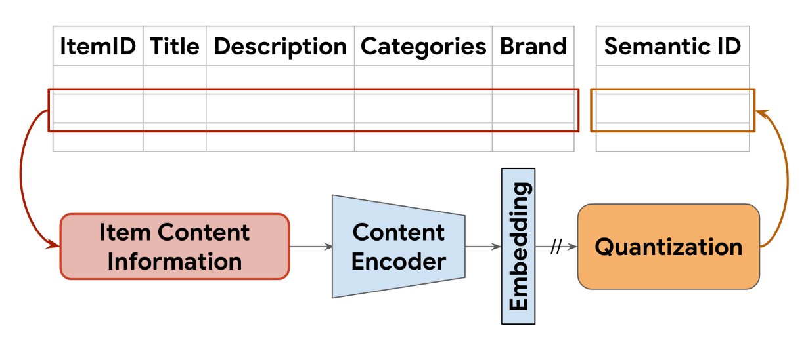
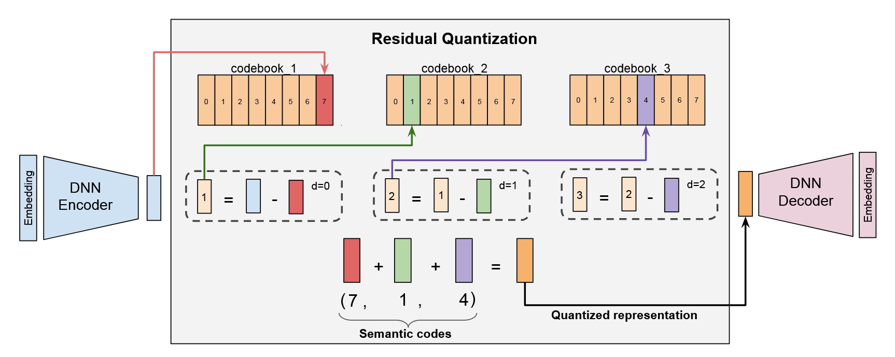
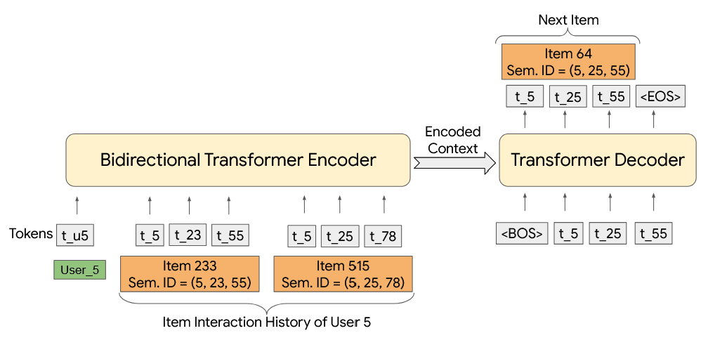

# TIGER (Transformer Index for Generative Recommenders)

**TIGER的基本思想**：使用能够描述物品内在语义的结构化“语义ID”代替毫无语义信息的原子ID。通过引入语义ID，模型不仅能够在相似物品间共享知识，还能用更紧凑的方式表示庞大的物品库。不同于传统的 query-candidate 匹配方法，该方法使用端到端的方式直接预测候选物品的ID。

>**Transformer Index是什么意思？**
>
>之所以叫 **"Transformer Index"（Transformer 索引）**，是因为它颠覆了传统推荐系统的检索方式，将“索引”这一概念直接内化到了 Transformer 模型本身。
>
>**1. 传统方法的“索引”是分离的**
>
>在传统的推荐系统（如双塔模型）中，检索过程是分两步的：
>
>- **编码**：先把所有候选物品编码成向量。
>- **建索引**：将这些向量存储在一个**外部的近似最近邻（ANN）索引**（如 Faiss 或 ScaNN）中 。
>- **检索**：推理时，模型生成用户向量，然后去这个**外部索引**里查找最相似的物品。
>
>**2. TIGER 的“索引”是模型参数**
>
>TIGER 移除了上述的外部索引步骤。所谓的 **"Transformer Index"** 指的是：
>
>- **参数即索引**：作者提出直接利用 Transformer 模型的**内存（即模型参数/权重）**来作为一个端到端的索引 。
>- **内化知识**：模型在训练过程中，通过学习输入（用户历史）与输出（物品语义 ID）之间的关系，将物品的信息直接“记忆”在了神经网络的参数里 。
>- **直接生成**：在检索时，不需要去外部数据库查找，模型直接根据输入的上下文，利用内部参数**生成（Generative）**出目标物品的 ID 。

## 1. 语义ID

从物品的内容信息（文本描述）中提取出一个codeword序列（序列长度为 $m$，其中每个codeword都来自不同的词表，这样语义ID的基数就等于各个词表的大小的乘积），作为物品的语义ID。

使用语义ID相比于使用传统的原子ID有很多好处：

1. **相似的物品之间可以共享知识**
2. 有助于**改善冷启动问题**，训练集中没有出现过的新物品也能够得到较好的预测
3. 可以**减小物品词表的基数**（使用多个小基数的码元ID替代单个大基数的原子ID），从而减少存储各个ID的嵌入向量所需的内存占用
4. 可以通过调整温度参数来**控制推荐结果的多样化程度**，同时，不同层级的采样随机性控制的物品类型粒度也不同

## 2. 网络结构

TIGER的实现分为以下两步：

1. 根据物品的内容特征为每个物品构建一个语义ID：先将物品的内容特征嵌入为一个向量，然后将这个嵌入向量量化为一个语义码本的元组，即物品的语义ID
2. 基于这些语义ID组成的序列来训练生成式推荐模型：基于序列到序列的模型框架，使用transformer模型

### 生成语义ID

假设每个物品都有对应的内容描述，包含一些丰富的语义信息（如名称、描述或图片等），同时，假设我们有一个预训练的内容编码器（可以使用一些通用的预训练文本编码器如Sentence-T5和BERT），可以生成内容描述对应的嵌入向量。通过对嵌入向量进行量化，得到每个物品的语义ID。

>#### 什么是量化（Quantization）？
>
>在模型训练与部署的语境下，**量化（Quantization）** 是一种通过降低数值表示的**精度**来压缩模型的技术。

上面描述的流程如下图所示：

通过量化嵌入向量生成语义ID的方式有很多种，作者希望选用的技术至少有如下性质：相似的物品（拥有相似的语义信息的物品）应该有重叠的语义ID，比如语义ID为`(10, 21, 35)`的物品应该与语义ID为`(10, 21, 40)`的物品更相似，而不是与语义ID为`(10, 23, 32)`的物品更相似。

#### TIGER使用的量化方法

TIGER使用残差量化变分自编码器（Residual-Quantized Variational AutoEncoder, RQ-VAE）来生成有层次的语义ID。

具体来说，RQ-VAE首先会将输入 $\boldsymbol{x}$  通过编码器 $\mathcal{E}$ 嵌入（注意：这里的嵌入与前面的文本语义嵌入不一样！输入的 $\boldsymbol{x}$ 才是语义嵌入的结果）为 $\boldsymbol{z}:=\mathcal{E}(\boldsymbol{x})$。初始的残差 $\boldsymbol{r}_0:=\boldsymbol{z}$，第 $d$ 层的codebook为 $\mathcal{C}_d:=\{\boldsymbol{e}_k\}_{k=1}^K$，其中 $K$ 为codebook的大小。在通过每一层时，会在当前层 $d$ 的codebook $\mathcal{C}_d$ 中找到与上一层得到的残差 $\boldsymbol{r}_{d-1}$ 最接近的embedding $\boldsymbol{e}_{c_d}$（其中 $c_d$ 为embedding在codebook中的索引），然后得到新的残差 $\boldsymbol{r}_d$，作为下一层的输入。这样递归 $m$ 次，得到的 $m$ 个索引就构成了语义ID。这个过程是对物品从粗颗粒度到细颗粒度分类的近似。注意：这里使用 $m$ 层大小为 $K$ 的不同的codebook，而不是使用1个大小为 $mK$ 的codebook，因为残差的范数会随着层数的增加而减小，这样就可以对不同的层次使用不同的颗粒度。得到的语义ID表示如下：
$$
(c_0,c_1,...,c_{m-1})
$$
这样 $\boldsymbol{z}$ 的量化结果就是 $\hat{\boldsymbol{z}}:=\sum_{d=0}^{m-1}\boldsymbol{e}_{c_i}$。$\hat{\boldsymbol{z}}$ 会被输入解码器，解码器会尝试根据 $\hat{\boldsymbol{z}}$ 重构输入 $\boldsymbol{x}$。如下图所示：

这里的编码器和解码器都是DNN。

RQ-VAE通过一个联合损失函数进行端到端训练，该函数包含重构损失（确保解码器能从量化表示中恢复原始信息）和量化损失（用于更新码本），从而联合优化编码器、解码器和所有码本向量：
$$
\mathcal{L}(x) := \mathcal{L}_{recon} + \mathcal{L}_{rqvae}
$$
其中 $\mathcal{L}_{recon} := ||x - \hat{x}||^{2}$ 为重构损失，$\mathcal{L}_{rqvae} := \sum_{d=0}^{m-1} \left( ||sg[r_{i}] - e_{c_{i}}||^{2} + \beta ||r_{i} - sg[e_{c_{i}}]||^{2} \right)$ 为量化损失。$sg$ 表示stop-gradient，即停止梯度操作（对应pytorch中的`.detach()`方法）。

> ##### Stop-gradient的作用
>
> 在 $\mathcal{L}_{rqvae}$ 中，stop-gradient 起到了分离优化目标的作用：
>
> 1. **第一项：更新码本 (Codebook Loss)**
>
>    $$||sg[r_{i}] - e_{c_{i}}||^{2}$$
>
>    - **操作**：对残差向量 $r_i$（编码器的输出）应用了 $sg$。
>
>    - **目的**：**只更新码本向量 $e_{c_{i}}$**。
>
>    - **解释**：这里的 $r_i$ 被视为目标值。模型试图移动码本中的向量 $e_{c_{i}}$，使其更靠近编码器输出的残差 $r_i$。由于 $r_i$ 被阻断了梯度，这一项不会改变编码器的参数 。
>
>      
>
> 2. **第二项：更新编码器 (Commitment Loss)**
>
>    $$\beta ||r_{i} - sg[e_{c_{i}}]||^{2}$$
>
>    - **操作**：对码本向量 $e_{c_{i}}$ 应用了 $sg$。
>    - **目的**：**只更新编码器（生成 $r_i$ 的网络）**。
>    - **解释**：这被称为“承诺损失”（Commitment Loss）。这里的码本向量 $e_{c_{i}}$ 被视为目标值。模型试图调整编码器的参数，使其输出的残差 $r_i$ 更靠近当前选定的码本向量。这防止了编码器的输出随意波动，强迫其“承诺”于某个码本向量。
>    - **参数 $\beta$**：是一个超参数（文中设为 0.25），用于调节这项损失的权重，防止编码器更新过快导致训练不稳定 。

以往研究显示RQ-VAE容易出现codebook坍塌的问题，即大部分的输入都被映射为仅有的几个codebook向量。为此，作者在这里使用了基于k-means聚类的codebook向量初始化，在第一个training batch中先进行k-means聚类，将每个类的质心作为初始codebook向量。

#### 其它可换用的量化方法

- Locality Sensitive Hashing (LSH)：消融实验表明RQ-VAE比LSH的效果更好

  > ##### 什么是LSH？
  >
  > LSH 的主要目的是将高维向量转换为离散的哈希码（即“语义码”），同时尽量保持原始空间的相似性 。文中具体采用了 **SimHash** 版本，其操作步骤如下 ：
  >
  > - **随机投影**：使用多组随机超平面 $w_1, ..., w_h$ 对物品的嵌入向量 $x$ 进行投影 （计算内积）。
  > - **二值化处理**：根据投影结果的正负符号，生成一个二值向量 。
  > - **整数转换**：将这些二值位转换为整数，形成一个 codeword 。
  > - **重复执行**：独立重复上述过程 $m$ 次，最终得到一个由 $m$ 个 codeword 组成的元组 $(c_0, c_1, ..., c_{m-1})$，作为该物品的 LSH 语义 ID 。

- k-means分层聚类：会丢失不同cluster之间的相似度语义信息

- VQ-VAE：不像RQ-VAE能对语义进行分层次的建模，分层的建模方式有很多好的性质

  >##### 什么是VQ-VAE ?
  >
  >**VQ-VAE**（Vector-Quantized Variational AutoEncoder，向量量化变分自编码器）是一种向量量化技术，其工作流程如下：
  >
  >- **编码与降维**：首先，将输入向量通过一个编码器（Encoder），以降低其维度 。
  >- **分区量化（关键特征）**：将降维后的向量进行**分区（Partitioned）**，然后对每一个分区分别进行量化 。
  >- **生成代码序列**：这一过程会产生一系列的代码，其中每个分区对应一个代码 。
  >- **重建**：解码器（Decoder）利用这些代码来重建原始向量 。

#### 冲突解决

受到嵌入向量的分布、codebook大小以及 $m$ 的取值影响，有时会出现语义冲突的问题，即多个物品被映射到同一个语义ID。为解决这一冲突，会在最后再添加一个token，用于区别不同的物品。比如某两个物品都被映射到语义ID `(12, 24, 52)`，会被分别编码为`(12, 24, 52, 0)`和`(12, 24, 52, 1)`。为了进行冲突检测，会维护一个将语义ID映射到对应物品的查找表。

注意：冲突检测和解决都是仅在RQ-VAE**训练完毕之后**进行的（为保证语义ID的长度一致，即使部分语义ID没有出现冲突，也会加入最后一位编码）。

由于语义ID是一个整数的元组而不是一个整数，上面的查找表在存储上的效率更高。

### 使用语义ID进行生成式检索

输入的是用户的物品的交互序列：
$$
\rm (item_1,...,item_n)
$$
要预测的是下一个可能交互的物品 $\rm item_{n+1}$。

第 $i$ 个物品的语义编码为 $(c_{i,0},...,c_{i,m-1})$，则序列模型的实际输入为 $n$ 个物品的语义编码拼接后的结果：
$$
(c_{1,0},...,c_{1,m-1},c_{2,0},...,c_{2,m-1},...,c_{n,0},...,c_{n,m-1})
$$
要预测的是第 $n + 1$ 个物品的语义ID：
$$
(c_{n+1,0},...,c_{n+1,m-1})
$$

由于预测的语义ID是直接生成的，可能存在预测的语义ID没有对应的物品的情况，但是实验表明这种概率很小（即使有效ID仅占所有可能的语义ID的很小一部分，具体可见第4.5节），且即便在生成少量无效ID的情况下，TIGER依然达到了SOTA。为确保生成的语义ID一定是有效的，可以增大束搜索的束的个数，并过滤掉无效的ID。另一种处理方式是对无效的语义ID进行前缀匹配，即从前向后选出与生成的无效ID相似度高的物品ID。

在seq2seq的具体实现中，由于语义ID中不同位置的码本不同，为了让模型能够正常处理输入，模型的词表实际上是所有码本的并集。此外，在序列的最前面还会加入用户相关的token，用于生成更加个性化的推荐，为限制词表大小，仅为用户ID生成2000种token，将任意用户ID哈希映射到其中的一个token。

## 3. 业务洞察

1. 语义ID中各个codeword的取值，可以视为物品在不同分类层级上的分类结果
2. TIGER的效果对 $m$ 和 $K$ 的大小变化不敏感，但是 $m$ 的增加会增大序列长度，从而增加计算成本
3. 由于TIGER是基于束搜索+自回归的，推理成本比传统的双塔+ANN方法要高

## 4. 参考内容链接

1. [Recommender Systems with Generative Retrieval](https://arxiv.org/pdf/2305.05065)
2. [FunRec 推荐系统 2.3.2.3节](https://datawhalechina.github.io/fun-rec/chapter_1_retrieval/3.sequence/2.generateive_recall.html)