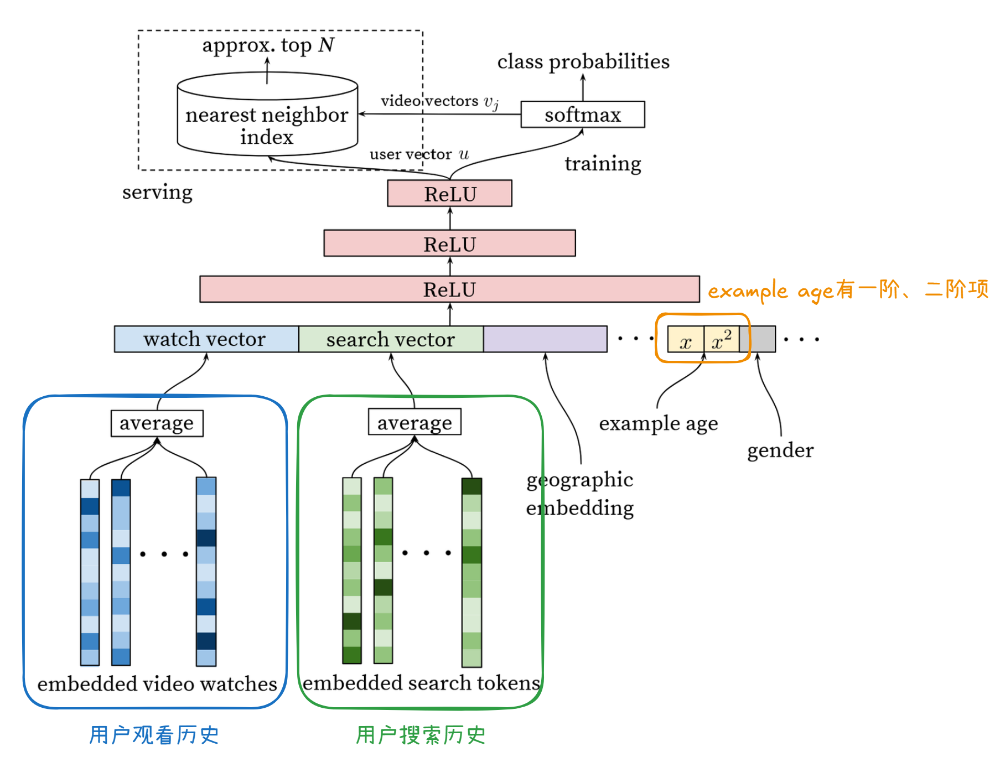

# YouTubeDNN (Deep Neural Networks for YouTube Recommendations)

:warning: **如有无法正常渲染的公式，可移步至同文件夹下的jupyter notebook**

> PS: [Deep Neural Networks for YouTube Recommendations](https://static.googleusercontent.com/media/research.google.com/zh-CN//pubs/archive/45530.pdf)论文原文实际上同时介绍了召回阶段和精排阶段的模型，但当前文件夹下的文件主要关注召回阶段的模型。

**YouTubeDNN召回模型的基本思想**：基于双塔模型的基本架构，思路与矩阵分解类似，但是使用神经网络来学习和表示用户向量 $\mathbf{\vec{U}}$ 和 物品向量 $\mathbf{\vec{V}}$，可以认为是矩阵分解的一种非线性推广，YouTubeDNN创新性地引入了example age作为特征，可以学习到视频新旧程度对于用户观看可能性的影响。

## 0. 背景

在进行YouTube视频推荐时，有三大挑战：

- **Scale**: 用户和视频规模是海量的。
- **Freshness**: YouTube上的视频池是动态变化的，算法要能够对新上传的视频做出迅速的相应，并权衡新旧视频的推荐情况。
- **Noise**: 用户与视频的交互历史是稀疏的，关于用户喜好的显式反馈信号（如点赞）较难获得，主要是有较大噪声的隐式反馈信号（如点击、查看）；视频的元数据一般都是poor-structured的。

## 1. 网络结构

### Embedding & Pooling Layer

“非对称”的双塔结构：用户塔集成了观看历史、搜索历史（将历史搜索的内容分解成为unigram和bigram tokens，得到这些token的嵌入向量，然后再做average pooling）、人口统计学特征等多模态信息（对于多类别的特征，先进行嵌入，对于简单的二分类/连续特征，归一化到[0, 1]），用户观看的视频ID通过嵌入层映射后进行平均池化聚合，模型还引入了“Example Age”特征来建模内容新鲜度的影响；物品塔则相对简化，本质上是一个巨大的嵌入矩阵，每个视频对应一个可学习的向量，避免了复杂的物品特征工程。

> #### Example Age
>
> 注意这里的age不是观看的视频的age，而是整个样本的age（这个样本产生到现在过了多长时间）。这个age具体使用什么数值，在training和serving时是有所不同的：
>
> - *Training*: 比如在时间 $t$ 用过去几周的数据作为训练数据，其中某样本是用户 $u$ 在时间 $t_0 < t$ 时产生的（我们获得了用户在时间 $t_0$ 前的观看历史、搜索历史等），它的 $age=t-t_0$。也就是age是样本相对于训练的时间锚点的时间差。
>
> - *Serving*: 关心在serving的此时此刻想看什么，因此 $age=0$ 或取一个很小的负数。
>
> 另外，example age在用户特征中同时以一阶（$x$）和二阶（$x^2$）的形式出现，是因为以往研究发现由于存在热点内容的“传播”效应，example age的二阶效应也很明显。
>
> 通过加入该特征，模型可以学会视频在其生命周期中的热度变化规律：比如，模型可能发现很多视频的观看都集中出现在example age前后相差不到一周的样本中，模型就会认为视频的热度持续时间通常不会超过一周。

### Dense Layer

引入非线性。

### Sampled Softmax

根据User（如观看历史，搜索历史）和Context（如人口统计学特征，exmaple age，用户性别等）的Embedding拼接得到的向量 $\mathbf{\vec{u}}$ 和 视频 $i$ 的Embedding向量 $\mathbf{\vec{v}}_i$，使用如下方式计算用户在时间 $t$ 观看视频 $i$ 的概率：
$$
P(w_t=i)=\frac{e^{\mathbf{\vec{v}}_i^T\mathbf{\vec{u}}}}{\sum_{j\in V}e^{\mathbf{\vec{v}}_j^T\mathbf{\vec{u}}}}
$$
$V$ 在理论上应该取所有视频的集合，但实际上通常仅从中采样一小部分。

## 2. 业务洞察

1. 对推荐系统做改进时，一般使用一些离线的评价指标（offline metrics），如precision, recall和ranking loss等。**但是最终验证模型的有效性，还是要通过A/B Testing得到的在线指标**（live metrics），因为两者的结果未必是一致的。
1. 虽然YouTube上是可以得到用户的一些显式反馈（如点赞）的，但是YouTubeDNN将隐式反馈（观看视频）作为label，用户观看完毕的视频作为正例，因为这样用户的历史信息会更丰富，即使在显式反馈极度稀疏的长尾区域也能生成推荐结果。
1. 根据A/B Testing的结果，推荐效果对于具体选用哪种最近邻搜索算法是不敏感的。
1. 训练样本应该不仅仅从我们推荐的视频中选取，而是从所有被观看了的视频中，否则模型可能会产生exploitation的偏差（重复推荐之前推荐效果好的视频），很难去推荐新的内容。如果用户在观看并非系统推荐的视频，需要能够通过协同过滤快速利用这一发现。
1. 改善在线指标的关键：为每个用户生成固定数目的训练样本，**避免少数高活跃度的用户主导loss**。
6. **避免信息泄露**：
   - YouTubeDNN中融入了用户搜索的token信息，但是如果模型知道用户最近搜索的token，可以直接推荐搜索到的视频，通过这种“作弊”的方式获得很低的loss，但是这样的模型在实际应用时的效果是很差的，因为相当于在训练时泄露了标签。为此，要丢弃序列信息（如使用无序的搜索词袋）。
   - 构造样本时，应该仅用历史预测未来，而不是在中间挖空（用历史和未来两侧的信息来预测空缺值）。因为视频往往有非对称的观看顺序，比如连续剧通常都是从前往后观看的，泄露了未来信息后，预测中间结果将变得很容易。

## 3. 代码实现Comments

### ✨ Features

- ✅ 支持用户静态类别类别和数值特征
- ✅ 支持用户搜索token历史
- ✅ 支持Example age
- ❌ 不支持除物品ID外的其它物品静态特征

为突出主要逻辑，模型和输入有一定的简化：

1. 召回topK个物品时，计算了所有候选物品的logit，没有用ANN。
1. 示例使用的数据集（MovieLens 1M）没有search history信息，这里假设movie的title为相应的搜索tokens，以测试相应功能。

## 4. 参考内容链接

1. [Deep Neural Networks for YouTube Recommendations](https://static.googleusercontent.com/media/research.google.com/zh-CN//pubs/archive/45530.pdf)
2. [FunRec 推荐系统 2.2.2.3节](https://datawhalechina.github.io/fun-rec/chapter_1_retrieval/2.embedding/2.u2i.html)
